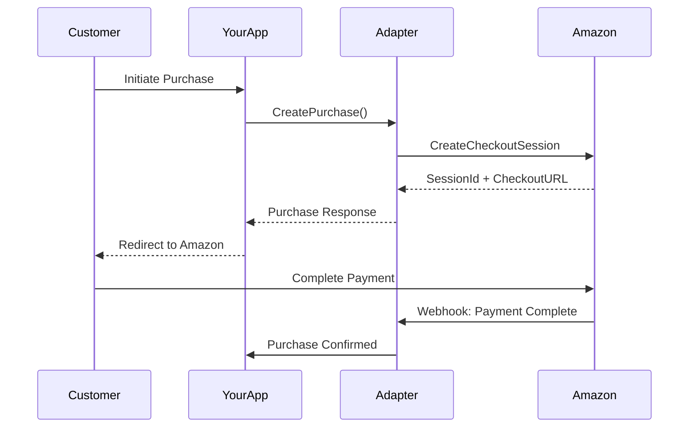
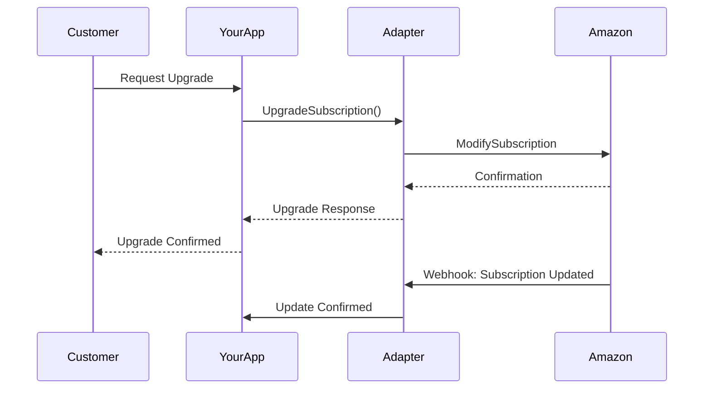
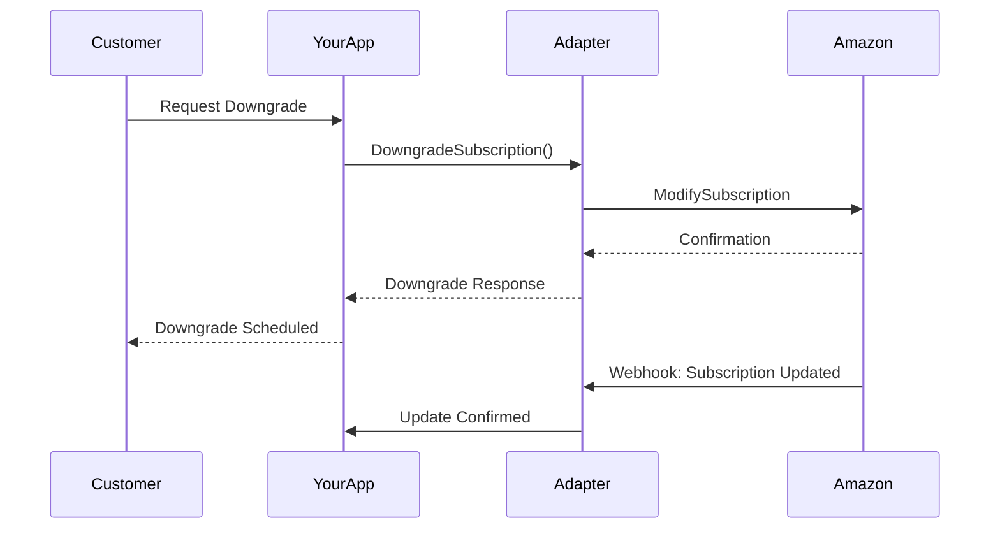
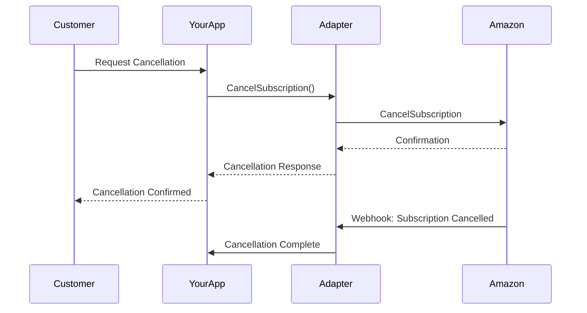

# Amazon Transaction Flows

This page documents all supported transaction flows for the Amazon adapter.

## Purchase Flow

The purchase flow handles both one-time payments and subscription initiation.

### Flow Diagram



### Implementation

<CodeGroup>

```javascript Node.js
const amazonAdapter = require('amazon-adapter');

// Create a purchase
const purchase = await amazonAdapter.createPurchase({
  amount: 9.99,
  currency: 'USD',
  productId: 'pro-monthly',
  customerId: 'customer-123',
  metadata: {
    plan: 'professional',
    period: 'monthly'
  }
});

// Handle the response
if (purchase.success) {
  // Redirect customer to Amazon checkout
  window.location.href = purchase.checkoutUrl;
}
```

```python Python
from amazon_adapter import AmazonAdapter

adapter = AmazonAdapter(config)

# Create a purchase
purchase = adapter.create_purchase(
    amount=9.99,
    currency='USD',
    product_id='pro-monthly',
    customer_id='customer-123',
    metadata={
        'plan': 'professional',
        'period': 'monthly'
    }
)

# Handle the response
if purchase.success:
    # Redirect customer to Amazon checkout
    return redirect(purchase.checkout_url)
```

</CodeGroup>

## Upgrade Flow

The upgrade flow allows customers to move to a higher-tier subscription.

### Flow Diagram



### Upgrade Rules

- **Immediate Upgrade**: Customer is charged the prorated difference
- **Next Billing Cycle**: Upgrade takes effect at the next renewal
- **Credit Application**: Any credits from the current plan are applied

### Implementation

```javascript
// Upgrade a subscription
const upgrade = await amazonAdapter.upgradeSubscription({
  subscriptionId: 'sub-123',
  newPlanId: 'enterprise-monthly',
  effectiveDate: 'immediate', // or 'next_billing_cycle'
  prorate: true
});

if (upgrade.success) {
  console.log(`Upgraded to ${upgrade.newPlan}`);
  console.log(`Next charge: ${upgrade.nextChargeAmount}`);
}
```

## Downgrade Flow

The downgrade flow manages moving customers to a lower-tier subscription.

### Flow Diagram



### Downgrade Rules

- **End of Billing Cycle**: Downgrade always takes effect at the end of the current period
- **Feature Access**: Customer retains higher-tier features until the downgrade date
- **No Refunds**: No prorated refunds for downgrades

### Implementation

```javascript
// Downgrade a subscription
const downgrade = await amazonAdapter.downgradeSubscription({
  subscriptionId: 'sub-123',
  newPlanId: 'basic-monthly',
  reason: 'customer_request',
  retainUntilEnd: true
});

if (downgrade.success) {
  console.log(`Downgrade scheduled for ${downgrade.effectiveDate}`);
}
```

## Cancel Flow

The cancel flow handles subscription cancellations with various options.

### Flow Diagram



### Cancellation Options

<Tabs>
  <Tab title="Immediate">
    - Subscription ends immediately
    - No refund for unused time
    - Access revoked instantly
  </Tab>
  <Tab title="End of Period">
    - Subscription ends at billing cycle end
    - Customer retains access until end date
    - No future charges
  </Tab>
  <Tab title="Pause">
    - Subscription temporarily suspended
    - Can be reactivated later
    - Billing paused during suspension
  </Tab>
</Tabs>

### Implementation

```javascript
// Cancel a subscription
const cancellation = await amazonAdapter.cancelSubscription({
  subscriptionId: 'sub-123',
  when: 'end_of_period', // or 'immediate'
  reason: 'too_expensive',
  feedback: 'Customer provided feedback here'
});

if (cancellation.success) {
  console.log(`Subscription ends on ${cancellation.endDate}`);
}
```

## Webhook Handling

All flows trigger webhooks for real-time updates:

```javascript
// Webhook handler
app.post('/webhooks/amazon', async (req, res) => {
  const event = req.body;
  
  switch(event.type) {
    case 'payment.completed':
      await handlePaymentCompleted(event.data);
      break;
    case 'subscription.updated':
      await handleSubscriptionUpdate(event.data);
      break;
    case 'subscription.cancelled':
      await handleCancellation(event.data);
      break;
  }
  
  res.status(200).send('OK');
});
```

## Error Scenarios

Common error scenarios and their handling:

<AccordionGroup>
  <Accordion title="Payment Declined">
    Handle declined payments gracefully with retry options
  </Accordion>
  <Accordion title="Invalid Plan">
    Validate plan changes before sending to Amazon
  </Accordion>
  <Accordion title="Duplicate Request">
    Implement idempotency keys to prevent duplicate transactions
  </Accordion>
  <Accordion title="Network Issues">
    Implement retry logic with exponential backoff
  </Accordion>
</AccordionGroup>

## Best Practices

1. **Idempotency**: Always use idempotency keys for transactions
2. **Validation**: Validate all inputs before API calls
3. **Logging**: Log all transactions for debugging
4. **Error Handling**: Implement comprehensive error handling
5. **Testing**: Test all flows in sandbox environment first