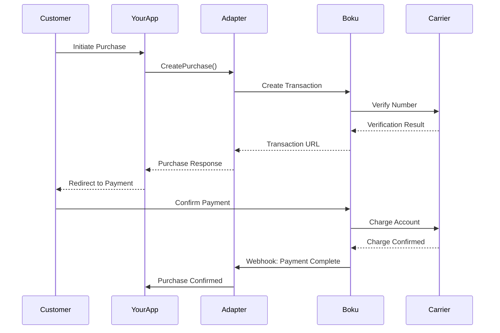

# Boku Transaction Flows

This page documents all supported transaction flows for the Boku adapter.

## Purchase Flow

The purchase flow handles mobile carrier billing and direct payments.

### Flow Diagram



### Implementation

<CodeGroup>

```javascript Node.js
const bokuAdapter = require('boku-adapter');

// Create a purchase
const purchase = await bokuAdapter.createPurchase({
  amount: 4.99,
  currency: 'USD',
  productId: 'premium-weekly',
  phoneNumber: '+1234567890',
  country: 'US',
  metadata: {
    userId: 'user-123',
    campaign: 'summer-2024'
  }
});

// Handle the response
if (purchase.success) {
  // Redirect to Boku payment page
  window.location.href = purchase.paymentUrl;
}
```

```python Python
from boku_adapter import BokuAdapter

adapter = BokuAdapter(config)

# Create a purchase
purchase = adapter.create_purchase(
    amount=4.99,
    currency='USD',
    product_id='premium-weekly',
    phone_number='+1234567890',
    country='US',
    metadata={
        'user_id': 'user-123',
        'campaign': 'summer-2024'
    }
)

# Handle the response
if purchase.success:
    # Redirect to Boku payment page
    return redirect(purchase.payment_url)
```

</CodeGroup>

## Mobile Number Verification

Boku requires phone number verification before processing payments:

### Verification Flow

```javascript
// Verify phone number first
const verification = await bokuAdapter.verifyPhoneNumber({
  phoneNumber: '+1234567890',
  country: 'US',
  sendSms: true
});

if (verification.requiresPin) {
  // Prompt user for SMS PIN
  const pin = await promptUserForPin();
  
  // Complete verification
  const confirmed = await bokuAdapter.confirmVerification({
    verificationId: verification.id,
    pin: pin
  });
}
```

## Subscription Management

### Recurring Payments Setup

```javascript
// Create recurring subscription
const subscription = await bokuAdapter.createSubscription({
  planId: 'monthly-premium',
  phoneNumber: '+1234567890',
  frequency: 'monthly',
  amount: 9.99,
  currency: 'USD',
  startDate: '2024-02-01'
});
```

## Upgrade Flow

Upgrading mobile subscriptions through Boku:

### Implementation

```javascript
// Upgrade subscription
const upgrade = await bokuAdapter.upgradeSubscription({
  subscriptionId: 'sub-123',
  newPlanId: 'premium-annual',
  effectiveDate: 'next_billing',
  notifyViaSms: true
});

if (upgrade.success) {
  console.log(`Upgrade scheduled for ${upgrade.effectiveDate}`);
}
```

## Downgrade Flow

Downgrading follows similar patterns with carrier-specific rules:

```javascript
// Downgrade subscription
const downgrade = await bokuAdapter.downgradeSubscription({
  subscriptionId: 'sub-123',
  newPlanId: 'basic-monthly',
  reason: 'cost_savings',
  keepUntilEnd: true
});
```

## Cancel Flow

### Cancellation Options

<Tabs>
  <Tab title="Immediate">
    ```javascript
    const cancel = await bokuAdapter.cancelSubscription({
      subscriptionId: 'sub-123',
      when: 'immediate',
      refundUnused: false
    });
    ```
  </Tab>
  <Tab title="End of Period">
    ```javascript
    const cancel = await bokuAdapter.cancelSubscription({
      subscriptionId: 'sub-123',
      when: 'end_of_period',
      sendConfirmationSms: true
    });
    ```
  </Tab>
</Tabs>

## Carrier-Specific Rules

Different carriers have specific requirements:

<AccordionGroup>
  <Accordion title="Verizon (US)">
    - Requires double opt-in for subscriptions
    - Monthly spending limits apply
    - SMS verification mandatory
  </Accordion>
  <Accordion title="O2 (UK)">
    - Supports direct carrier billing
    - Age verification required for certain content
    - Weekly spending caps
  </Accordion>
  <Accordion title="DoCoMo (Japan)">
    - Requires carrier account linking
    - Supports micropayments
    - Monthly billing cycles only
  </Accordion>
</AccordionGroup>

## Webhook Handling

Boku sends webhooks for all transaction states:

```javascript
// Webhook handler
app.post('/webhooks/boku', async (req, res) => {
  const event = req.body;
  
  // Verify signature
  if (!bokuAdapter.verifyWebhook(req.body, req.headers['x-boku-signature'])) {
    return res.status(401).send('Invalid signature');
  }
  
  switch(event.type) {
    case 'charge.success':
      await handleChargeSuccess(event.data);
      break;
    case 'charge.failed':
      await handleChargeFailed(event.data);
      break;
    case 'subscription.renewed':
      await handleSubscriptionRenewed(event.data);
      break;
  }
  
  res.status(200).send('OK');
});
```

## Error Handling

Common error scenarios in mobile payments:

<AccordionGroup>
  <Accordion title="Invalid Phone Number">
    Validate format and carrier support before processing
  </Accordion>
  <Accordion title="Spending Limit Exceeded">
    Check carrier limits and provide alternative payment methods
  </Accordion>
  <Accordion title="Carrier Unavailable">
    Implement fallback payment options
  </Accordion>
  <Accordion title="SMS Delivery Failed">
    Provide manual PIN entry option
  </Accordion>
</AccordionGroup>

## Testing

Boku provides test phone numbers for each country:

```javascript
const testNumbers = {
  US: {
    success: '+15555551234',
    declined: '+15555551235',
    limitExceeded: '+15555551236'
  },
  UK: {
    success: '+445555551234',
    declined: '+445555551235'
  }
};
```

## Best Practices

1. **Phone Number Validation**: Always validate format before submission
2. **Fraud Prevention**: Implement velocity checks and limits
3. **SMS Handling**: Provide clear instructions for PIN entry
4. **Error Messages**: Use carrier-specific error messages
5. **Compliance**: Follow local regulations for mobile payments