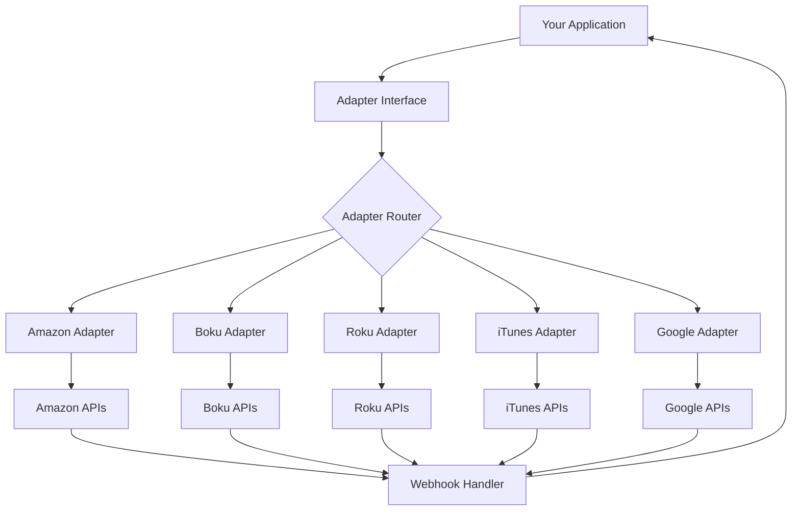
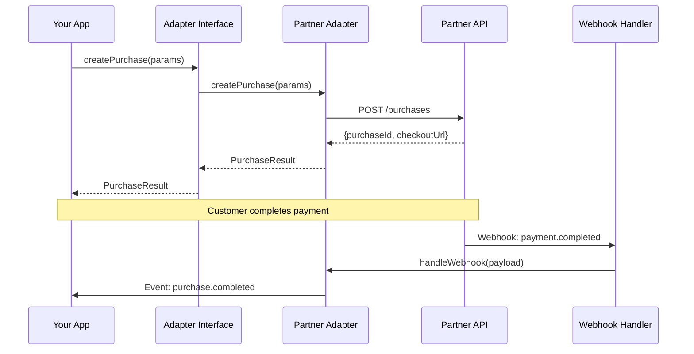

# Architecture Overview

The Partner Adapters system follows a modular, scalable architecture designed for reliability and ease of integration.

## High-Level Architecture



## Core Components

### 1. Adapter Interface

The central interface that all adapters implement:

```typescript
interface PartnerAdapter {
  // Initialize the adapter
  initialize(config: AdapterConfig): Promise<void>;
  
  // Core operations
  createPurchase(params: PurchaseParams): Promise<PurchaseResult>;
  upgradeSubscription(params: UpgradeParams): Promise<UpgradeResult>;
  downgradeSubscription(params: DowngradeParams): Promise<DowngradeResult>;
  cancelSubscription(params: CancelParams): Promise<CancelResult>;
  
  // Webhook handling
  handleWebhook(payload: WebhookPayload): Promise<WebhookResult>;
  
  // Status and management
  getStatus(id: string): Promise<StatusResult>;
  getHealth(): Promise<HealthStatus>;
}
```

### 2. Adapter Router

Routes requests to the appropriate adapter based on configuration:

```javascript
class AdapterRouter {
  constructor(config) {
    this.adapters = {
      amazon: new AmazonAdapter(config.amazon),
      boku: new BokuAdapter(config.boku),
      roku: new RokuAdapter(config.roku),
      itunes: new ITunesAdapter(config.itunes),
      google: new GoogleAdapter(config.google)
    };
  }
  
  getAdapter(partnerName) {
    return this.adapters[partnerName];
  }
}
```

### 3. Individual Adapters

Each adapter implements partner-specific logic while conforming to the standard interface:

<Tabs>
  <Tab title="Amazon">
    - OAuth 2.0 authentication
    - RESTful API integration
    - Real-time webhooks
    - Multi-currency support
  </Tab>
  <Tab title="Boku">
    - API key authentication
    - Mobile-optimized flows
    - Carrier billing support
    - SMS verification
  </Tab>
  <Tab title="Roku">
    - Token-based auth
    - Channel store integration
    - Device-specific flows
    - Subscription management
  </Tab>
  <Tab title="iTunes">
    - App Store Connect API
    - Receipt validation
    - Sandbox testing
    - StoreKit integration
  </Tab>
  <Tab title="Google">
    - Google Play API v3
    - Service account auth
    - Real-time notifications
    - Multi-app support
  </Tab>
</Tabs>

### 4. Webhook Handler

Centralized webhook processing for all adapters:

```javascript
class WebhookHandler {
  async process(source, payload, signature) {
    // Verify signature
    const isValid = await this.verifySignature(source, payload, signature);
    if (!isValid) throw new Error('Invalid signature');
    
    // Route to adapter
    const adapter = this.router.getAdapter(source);
    const result = await adapter.handleWebhook(payload);
    
    // Emit events
    this.eventEmitter.emit(result.eventType, result.data);
    
    return result;
  }
}
```

## Data Flow

### Purchase Flow Example



## Security Architecture

### Authentication Layers

1. **Application Layer**: Your app authenticates with the adapter system
2. **Adapter Layer**: Each adapter authenticates with its partner API
3. **Webhook Layer**: Signature verification for incoming webhooks

### Security Best Practices

<Info>
All sensitive data is encrypted in transit and at rest. API credentials are stored in secure vaults and never exposed in logs or error messages.
</Info>

```javascript
// Example: Secure credential handling
class SecureAdapter {
  constructor(config) {
    this.credentials = {
      clientId: process.env[`${config.partner}_CLIENT_ID`],
      clientSecret: process.env[`${config.partner}_CLIENT_SECRET`]
    };
    
    // Never log credentials
    this.logger = new Logger({
      redactKeys: ['clientSecret', 'apiKey', 'token']
    });
  }
}
```

## Scalability Considerations

### Horizontal Scaling

The adapter system supports horizontal scaling:

```yaml
# Example: Kubernetes deployment
apiVersion: apps/v1
kind: Deployment
metadata:
  name: partner-adapters
spec:
  replicas: 3
  selector:
    matchLabels:
      app: partner-adapters
  template:
    spec:
      containers:
      - name: adapters
        image: company/partner-adapters:latest
        resources:
          requests:
            memory: "512Mi"
            cpu: "500m"
          limits:
            memory: "1Gi"
            cpu: "1000m"
```

### Rate Limiting

Built-in rate limiting per partner:

```javascript
const rateLimiter = new RateLimiter({
  amazon: { requests: 100, window: '1s' },
  boku: { requests: 50, window: '1s' },
  roku: { requests: 30, window: '1s' },
  itunes: { requests: 60, window: '1s' },
  google: { requests: 100, window: '1s' }
});
```

### Caching Strategy

<Tabs>
  <Tab title="Redis Cache">
    ```javascript
    // Subscription status caching
    const cache = new RedisCache({
      ttl: 300, // 5 minutes
      prefix: 'partner:subscription:'
    });
    ```
  </Tab>
  <Tab title="In-Memory Cache">
    ```javascript
    // Configuration caching
    const configCache = new MemoryCache({
      maxSize: 1000,
      ttl: 3600 // 1 hour
    });
    ```
  </Tab>
</Tabs>

## Monitoring & Observability

### Metrics Collection

Key metrics tracked for each adapter:

- Request rate and latency
- Success/failure rates
- Webhook delivery success
- API rate limit usage

### Example Monitoring Setup

```javascript
// Prometheus metrics
const metrics = {
  requests: new Counter({
    name: 'adapter_requests_total',
    help: 'Total adapter requests',
    labelNames: ['partner', 'operation', 'status']
  }),
  
  latency: new Histogram({
    name: 'adapter_request_duration_seconds',
    help: 'Request latency',
    labelNames: ['partner', 'operation'],
    buckets: [0.1, 0.5, 1, 2, 5]
  })
};
```

### Logging Architecture

Structured logging for better observability:

```javascript
logger.info('Purchase created', {
  adapter: 'amazon',
  purchaseId: 'pur_123',
  amount: 29.99,
  currency: 'USD',
  customerId: 'cust_456',
  duration: 1.234
});
```

## Deployment Patterns

### Microservices Architecture

Each adapter can be deployed as a separate service:

```yaml
services:
  adapter-gateway:
    image: company/adapter-gateway
    ports:
      - "8080:8080"
    
  amazon-adapter:
    image: company/amazon-adapter
    environment:
      - PARTNER=amazon
    
  boku-adapter:
    image: company/boku-adapter
    environment:
      - PARTNER=boku
```

### Monolithic Deployment

All adapters in a single deployment:

```dockerfile
FROM node:18-alpine
WORKDIR /app
COPY . .
RUN npm install
EXPOSE 3000
CMD ["node", "server.js"]
```

## Disaster Recovery

### Backup Strategy

- Regular configuration backups
- Transaction log retention
- Webhook replay capability

### Failover Patterns

```javascript
class FailoverAdapter {
  async execute(operation, params) {
    try {
      return await this.primary[operation](params);
    } catch (error) {
      if (this.isRetryable(error)) {
        return await this.secondary[operation](params);
      }
      throw error;
    }
  }
}
```

## Future Considerations

### Planned Enhancements

1. **GraphQL API**: Unified query interface
2. **Event Streaming**: Real-time event distribution
3. **AI-Powered Routing**: Intelligent adapter selection
4. **Blockchain Integration**: Decentralized payment support

### Extensibility

The architecture supports easy addition of new adapters:

```javascript
// Adding a new adapter
class NewPartnerAdapter extends BaseAdapter {
  async createPurchase(params) {
    // Implementation specific to new partner
  }
}

// Register the adapter
adapterRegistry.register('newpartner', NewPartnerAdapter);
```

## Summary

The Partner Adapters architecture provides:

- **Modularity**: Easy to add new partners
- **Scalability**: Horizontal scaling support
- **Reliability**: Built-in retry and failover
- **Security**: Multiple authentication layers
- **Observability**: Comprehensive monitoring

This architecture ensures your payment integrations are robust, maintainable, and ready for growth.